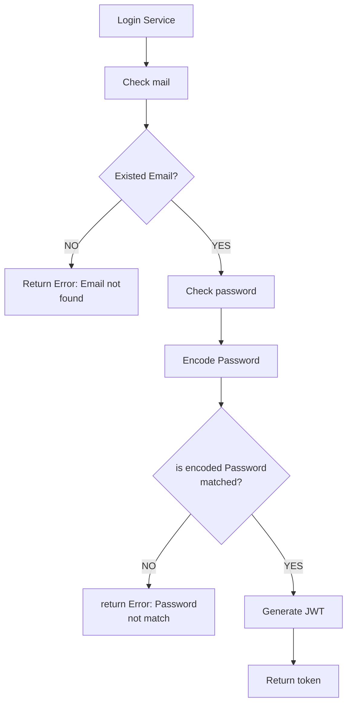

```mermaid
flowchart TD
  C[Login Service]
  D[Check mail]
  E{Existed Email?}
  F[Return Error: Email not
  found]
  G[Check password]
  A[Encode Password]
  B{is encoded Password
  matched?}
  H[Return token]
  I[return Error: Password
  not match]
  J[Generate JWT]

  C --> D --> E
  E --> |NO|F
  E --> |YES|G --> A --> B

  B --> |NO|I
  B --> |YES|J --> H
```