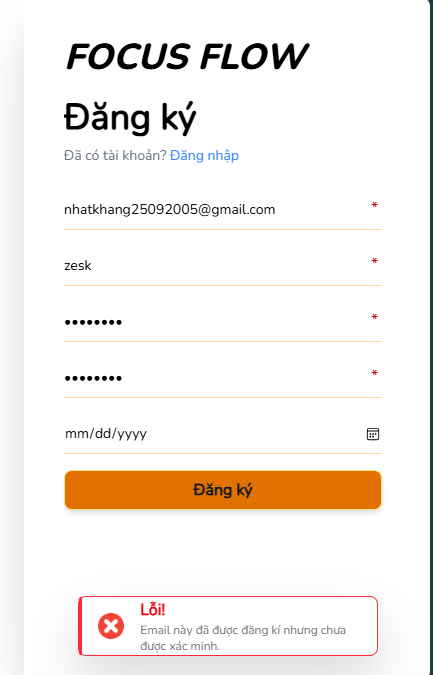

# Register UI Test Cases

## TC-REG-002: Existing unverified account

**Type:** Manual UI test
**Priority:** High

### Preconditions

- Frontend and backend are running.
- An unverified account exists with `nhatkhang2509005@gmail.com`.
- Language is Vietnamese.

### Steps

1. Open the registration page.
2. Enter valid registration information.
3. Use `nhatkhang25092005@gmail.com`.
4. Click Register.

### Expected result

- The API responds with code `USER_NOT_VERIFY`.
- An error toast appears.
- Toast message: `This email has been registered but not verified.`
- Form is not cleared.
- No success popup appears.

### Actual result

_To be completed during testing._

### Status

`PASSED`

### Evidence

