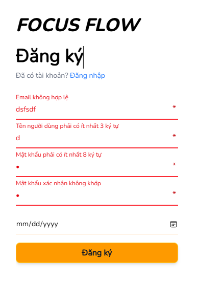

# Register UI Test Cases

## TC-REG-003: Backend validation failure

**Type:** Manual UI test
**Priority:** High

### Preconditions

- Frontend is running.
- Language is English.

### Steps

1. Open the registration pag
2. Enter invalid registration information.
3. Enter valid registration information.
4. Click Register.

### Expected result
- Errors displays on fields
- Form is not cleared.
- Realtime error catching when re-entering field
- The page does not navigate away.

### Actual result

_To be completed during testing._

### Status

`PASSED`

### Evidence

